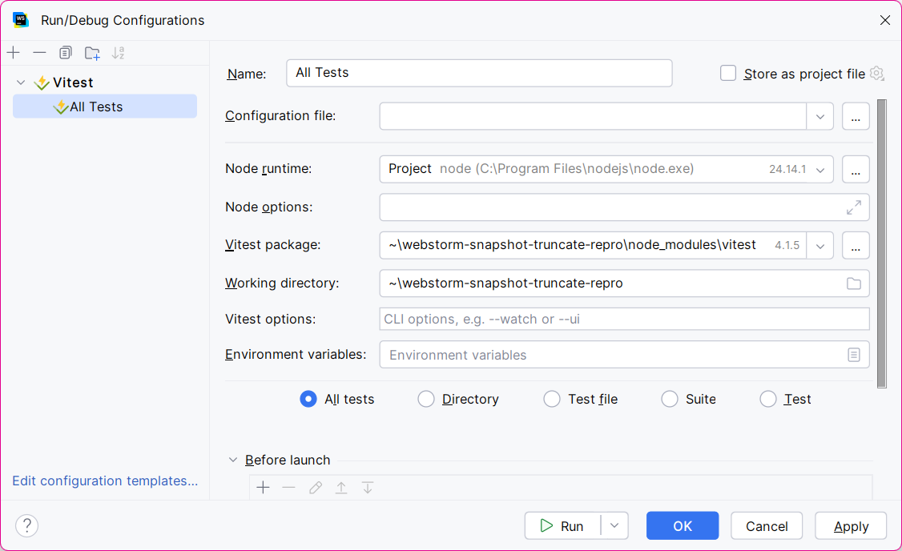
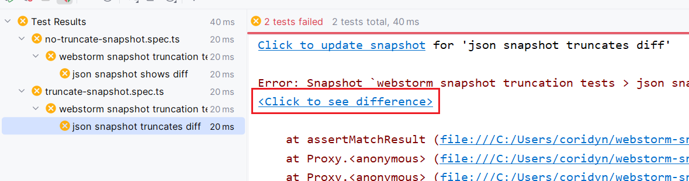
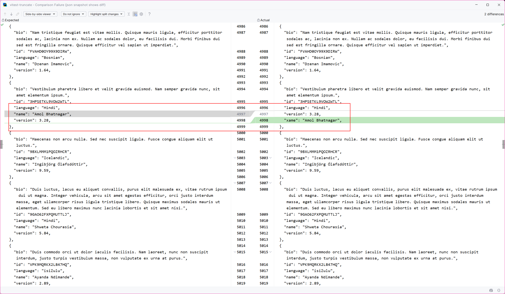
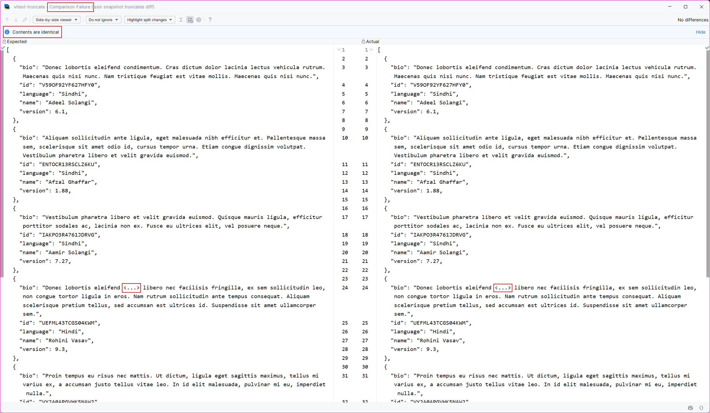

This repository reproduces an issue with Webstorm's diffing of snapshot files (e.g. Vitest and Jest snapshots).

---

Steps to reproducce:

1. Clone this repository
2. Install npm dependencies (vitest): `npm install --ignore-scripts`
3. Open this project in Webstorm
4. Create a Vitest "Run" configuration that runs all tests (defaults are fine)
   * 
5. Run all tests
   * There are two tests, both are expected to fail with a snapshot mismatch
6. In the "Run" window, click "<Click to see difference>" to launch the snapshot diff in Webstorm
   * 

**Expected behavior:**
  * Webstorm should show the full diff for mismatched snapshots
  * "json snapshot shows diff" - expected behavior, correctly shows diff for snapshots <512KB
    * See: 

**Actual behaviour:**
  * "json snapshot truncates diff" - large snapshot diffs (>512KB) are truncated, hiding any differences in the middle of the snapshot and making it difficult to use snapshot tests
    * See: 
  * large snapshots are truncated to the first and last 1000 characters (with `<...>` marking the truncation point)
  * any differences between the snapshots in the middle of the file are missing from the diff and Webstorm shows "Contents are identical", even though the test has failed with a mismatched snapshot

---

Environment:

OS version: Windows 11 25H2 Build 26200.8246; macOS 26.4.1
IDE version: WebStorm 2026.1; Build #WS-261.22158.274, built on March 25, 2026

---

Background:

* Vitest and Jest 
  * tests that have snapshots of large JSON objects (>512KB)
  * the issue does not occur with smaller snapshots (Webstorm does not truncate the diff and is able to correctly show the difference between the expected and actual snapshots)
* The tests are run in Webstorm
  * The issue occurs when Webstorm shows the diff between the expected and actual snapshot
  * The issue does not occur when running tests directly in Vitest or `vitest --ui`
  * When there is a large snapshot, Webstorm will truncate the snapshots to the first 1000 characters and last 1000 characters.
  * Any differences between the snapshots in the middle of the file are excluded from the diff and Webstorm shows "Contents are identical", even though the test has failed with mismatched snapshot.

